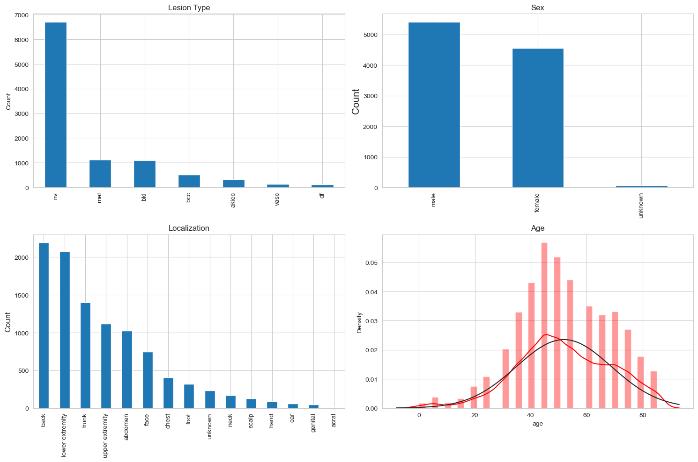
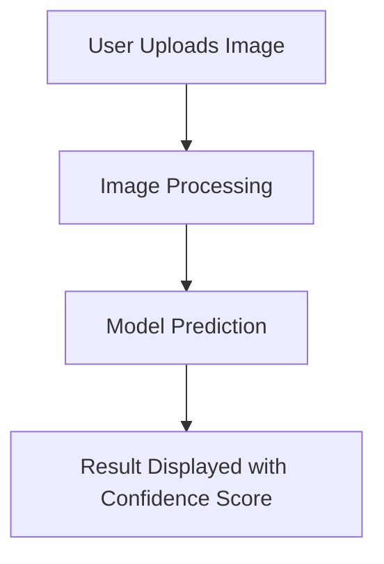

# AI-enabled Skin Cancer Diagnosis Assistant

This project focuses on building an **AI-based web application** that uses **deep learning** to classify various types of skin cancer lesions. It addresses the need for accurate, real-time, and early diagnosis of skin cancer, particularly focusing on the differentiation between melanoma and non-melanoma skin lesions. The backbone of this system is a **Convolutional Neural Network (CNN)**, trained to classify pigmented skin lesions into seven categories based on dermoscopic images. 

## Introduction

Skin cancer is among the most common types of cancer worldwide, with increasing numbers diagnosed every year. **Early diagnosis** can drastically improve survival rates. Traditionally, dermatologists rely on **dermoscopy** for diagnosis, which is time-consuming and heavily dependent on the expertise of the practitioner. This project uses **deep learning techniques** to assist medical professionals by providing automated classification of skin lesions, thereby offering a **quick and reliable second opinion**.

## Why Convolutional Neural Networks (CNN)?

The project places a heavy emphasis on **Convolutional Neural Networks (CNN)** over **Artificial Neural Networks (ANN)** due to the nature of the task—image classification. Traditional machine learning and ANN approaches depend heavily on **manual feature extraction** from images, which can be error-prone and time-consuming. CNNs are particularly suitable for this task because:
1. **Automatic Feature Extraction**: CNNs learn to extract hierarchical features directly from raw images without human intervention.
2. **Spatial Hierarchy**: The convolution operation allows CNNs to capture local patterns (like edges, textures) which are crucial for image analysis, while deeper layers capture more complex structures.
3. **Efficiency**: CNNs reduce the dimensionality of input images while maintaining relevant information through techniques like pooling, making them computationally efficient.

Compared to **ANNs**, which struggle with large image inputs, CNNs are much more suited to the high-dimensional nature of image data. This makes CNNs the preferred choice for skin cancer diagnosis, where subtle visual cues differentiate between cancerous and non-cancerous lesions.

## Exploring the Dataset

The dataset used for training and evaluating the models in this project is derived from the **International Skin Imaging Collaboration (ISIC)** archive, which is a well-known repository for dermoscopic images of skin lesions. This dataset is crucial for developing a robust model capable of distinguishing between different types of skin cancer lesions.

### Dataset Characteristics:
- **Size**: The dataset consists of thousands of high-quality dermoscopic images.
- **Classes**: The images are categorized into seven distinct classes, including melanoma, basal cell carcinoma, and benign keratosis, among others.
- **Image Quality**: Each image is captured under standardized conditions to ensure consistency and reliability in model training.
- **Annotations**: The dataset includes expert annotations, providing ground truth labels for each image, which are essential for supervised learning.

### Data Preprocessing:
To prepare the dataset for model training, several preprocessing steps are applied:
1. **Resizing**: Images are resized to match the input dimensions required by the CNN models (e.g., 128x128, 224x224).
2. **Normalization**: Pixel values are normalized to a range of [0, 1] to facilitate faster convergence during training.
3. **Augmentation**: Techniques such as rotation, flipping, and zooming are employed to artificially expand the dataset and improve model generalization.

## Handling Imbalanced Classes

In the context of skin cancer diagnosis, the dataset often exhibits class imbalance, where certain types of lesions are more prevalent than others. This imbalance can lead to biased model predictions, favoring the majority classes. To address this issue, several strategies were employed:

1. **Data Augmentation**: Additional synthetic samples were generated for underrepresented classes using techniques such as rotation, flipping, and color jittering. This helps in balancing the class distribution and improving model generalization.

2. **Class Weighing**: During model training, class weights were adjusted inversely proportional to class frequencies. This ensures that the model pays more attention to minority classes, reducing bias towards majority classes.

3. **Resampling Techniques**: Both oversampling of minority classes and undersampling of majority classes were explored to create a more balanced training dataset. This was done carefully to avoid overfitting or losing important information.

4. **Use of Focal Loss**: Focal loss was implemented as an alternative to standard cross-entropy loss. It focuses more on hard-to-classify examples, which are often from minority classes, thus improving the model's ability to learn from imbalanced data.

By integrating these techniques, the project aims to enhance the model's performance across all classes, ensuring reliable and unbiased skin cancer diagnosis.

### Dataset Split:
The dataset is split into training, validation, and test sets to evaluate the model's performance effectively:
- **Training Set**: Used to train the model, comprising the majority of the dataset.
- **Validation Set**: Used to tune hyperparameters and prevent overfitting.
- **Test Set**: Used to assess the final model's performance on unseen data.

By leveraging this comprehensive dataset, the project aims to build a highly accurate and reliable skin cancer diagnosis assistant that can aid dermatologists in clinical settings.

---

## Project Structure

### Key Objectives:
1. Develop a robust **CNN-based classification model** capable of differentiating between seven types of skin lesions.
2. Build a **web application** that enables users to upload dermoscopic images for real-time automated diagnosis.
3. Use **transfer learning** with pre-trained models like **ResNet50**, **MobileNetV2**, and **EfficientNetV2** to improve the accuracy and reduce training time.

---

## Experiments and Results

### Comparison between CNN and ANN models:
| Model               | Feature Extraction | Image Input Size | Complexity | Accuracy | AUC-ROC |
|---------------------|--------------------|------------------|------------|----------|---------|
| **ANN**             | Manual             | Low              | Medium     | 70.23%   | 0.82    |
| **CNN**             | Automatic          | High (128x128)   | High       | 80.45%   | 0.95    |
| **CNN with Transfer Learning** | Automatic  | High (224x224)   | High       | 82.89%   | 0.96    |

The performance of CNN models clearly surpasses that of traditional ANNs, thanks to their ability to automatically learn and extract relevant features from raw image data.

### Experiments on CNN Architectures:

Several deep learning models were trained and fine-tuned using **transfer learning**. Below is the summary of experiments conducted:

| Experiment | Model Used                    | Input Size | Architecture             | Validation Accuracy | AUC-ROC | Top 2 Accuracy | Top 3 Accuracy |
|------------|-------------------------------|------------|--------------------------|---------------------|---------|----------------|----------------|
| 1          | CNN (Custom)                  | 128x128    | Simple CNN               | 68.5%               | 0.82    | 80.15%         | 90.34%         |
| 2          | CNN (Custom, Dropout Layers)  | 224x224    | CNN with Dropout         | 70.23%              | 0.84    | 82.1%          | 92.5%          |
| 3          | **ResNet50 (Transfer Learning)** | 224x224  | Pre-trained ResNet50     | 75.34%              | 0.85    | 80.12%         | 91.34%         |
| 4          | **EfficientNetV2 (Fine-tuned)** | 240x240  | Transfer Learning         | 80.45%              | 0.9517  | 87.99%         | 94.05%         |
| 5          | **MobileNetV2 (Fine-tuned)**  | 224x224    | Transfer Learning         | 77.89%              | 0.89    | 85.23%         | 92.78%         |
| 6          | ResNet50 (Fine-tuned)         | 224x224    | Transfer Learning         | 78.9%               | 0.9     | 86.54%         | 92.5%          |
| 7          | InceptionResNetV2 (Fine-tuned)| 299x299    | Transfer Learning         | 79.23%              | 0.92    | 85.45%         | 93.8%          |

### Model Evaluation:
- **EfficientNetV2** emerged as the best performing model with an accuracy of **80.45%** and **AUC-ROC score of 0.9517**. This model was fine-tuned from a pre-trained network, enabling it to generalize well on new skin lesion images.
- **MobileNetV2** and **ResNet50** also performed well, with **ResNet50** showing strong results in both its pre-trained and fine-tuned forms.

### Performance Metrics:
| Metric                | Description                                                                 |
|-----------------------|-----------------------------------------------------------------------------|
| **Accuracy**          | Proportion of correct predictions out of all predictions made.               |
| **AUC-ROC**           | Area Under the Receiver Operating Characteristic curve for multi-class classification. |
| **Precision**         | Proportion of true positives out of all positive predictions.                |
| **Recall**            | Proportion of true positives out of all actual positives.                    |
| **F1 Score**          | Harmonic mean of precision and recall, balancing both.                       |
| **Top 2 Accuracy**    | Proportion of instances where the correct label is in the top 2 predictions. |
| **Top 3 Accuracy**    | Proportion of instances where the correct label is in the top 3 predictions. |

---

## Application Development

The web application is developed using **Flask** and deployed using **Heroku** for real-time diagnosis. It allows users to upload images of skin lesions, which are pre-processed and fed into the trained deep learning model for classification.

### Tools and Technologies Used:
| Tool       | Purpose                         |
|------------|----------------------------------|
| **Flask**  | Python-based web framework for building the app. |
| **Docker** | Containerization for seamless deployment across environments. |
| **Heroku** | Cloud platform for application deployment. |
| **Git**    | Version control for managing code. |

### Application Flow:
1. **Image Upload**: Users upload an image of a skin lesion.
2. **Preprocessing**: Image is resized and normalized to match the input requirements of the model.
3. **Prediction**: The model classifies the image into one of seven skin cancer types.
4. **Result Display**: The prediction result and confidence score are shown to the user.

### Flowchart:

---

## Conclusion

This project showcases the effectiveness of **CNNs** for image classification tasks, particularly in the medical domain for skin cancer diagnosis. By combining deep learning techniques with a web-based platform, this tool demonstrates a potential real-world application for automated skin lesion diagnosis. The success of **EfficientNetV2** and other transfer learning models emphasizes the potential of **pre-trained models** in providing high accuracy with minimal training time. 

Further improvements in terms of dataset size, model optimization, and additional features like explainability could expand the scope and applicability of this solution.

---

## Deployment

The application is containerized using Docker and deployed on Heroku for scalability and ease of access.

---

## References

1. World Cancer Research Fund International. (2020). Skin Cancer Statistics.
2. Challenge ISIC Archive - https://challenge.isic-archive.com/
3. Tensorflow for Deep Learning (Models)

